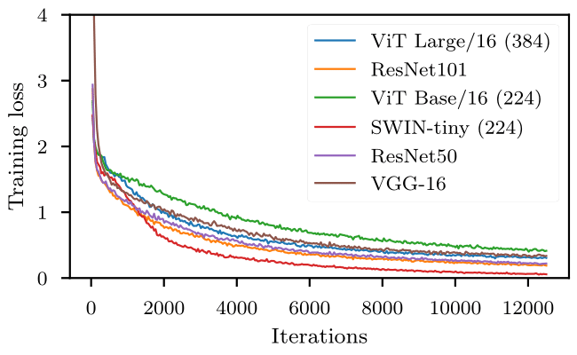

# VALUED - Vision and Logical Understanding Evaluation Dataset.
---
This repository contains code for the paper at (https://arxiv.org/abs/2311.12610)
- Authors : [Soumadeep Saha](https://www.isical.ac.in/~soumadeep.saha_r), [Saptarshi Saha](https://openreview.net/profile?id=~Saptarshi_Saha1), [Utpal Garain](https://www.isical.ac.in/~utpal).
- View samples from the dataset - [dataset page](https://espressovi.github.io/VALUED).
## Abstract

Starting with early successes in computer vision tasks, deep learning based techniques have since overtaken state of the art approaches in a multitude of domains. However, it has been demonstrated time and again that these techniques fail to capture semantic context and logical constraints, instead often relying on spurious correlations to arrive at the answer. Since application of deep learning techniques to critical scenarios are dependent on adherence to domain specific constraints, several attempts have been made to address this issue. One limitation holding back a thorough exploration of this area, is a lack of suitable datasets which feature a rich set of rules. In order to address this, we present the VALUE (Vision And Logical Understanding Evaluation) Dataset, consisting of 200,000+ annotated images and an associated rule set, based on the popular board game - chess. The curated rule set considerably constrains the set of allowable predictions, and are designed to probe key semantic abilities like localization and enumeration. Alongside standard metrics, additional metrics to measure performance with regards to logical consistency is presented. We analyze several popular and state of the art vision models on this task, and show that, although their performance on standard metrics are laudable, they produce a plethora of incoherent results, indicating that this dataset presents a significant challenge for future works.

---

## Usage

### To generate data
  - The 3D scene can be found at rendering/board.blend and relevant assets in rendering/assets and rendering/textures
  - Follow instructions in rendering/README.md
  - It takes 4+ days to generate 200,000 images on a 32 core CPU (AMD Threadripper).

### Download data
  - The generated train/test set along with all labels can be found [here](https://zenodo.org/records/10607059).
  - The DOI for the dataset is 10.5281/zenodo.8278014.
  - Checksum md5:933bda0043415922c1f862b417e9317a.
  - The dataset is 18.5 GB

### Train baseline models
  - Generate or download data.
  - Follow instructions in baselines/README.md

## Training graphs

